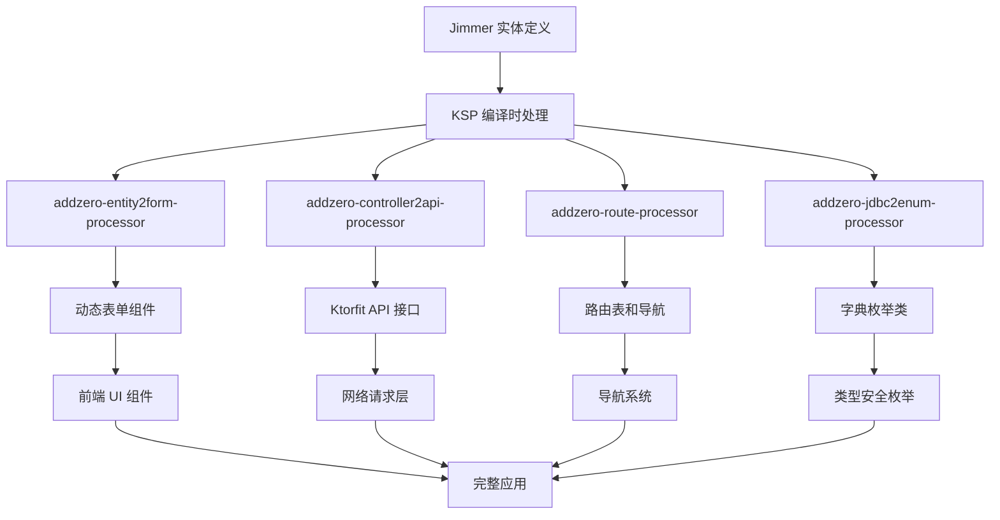

# KMP Jimmer 全栈脚手架

> 基于 Kotlin Multiplatform + Jimmer 的现代化全栈开发脚手架，通过 KSP 实现前后端代码生成的完美一致性

## 🚀 技术栈
[](https://skillicons.dev)

## 📸 项目展示


## ✨ 核心特性

### 🎯 **一致性保证** - 单一数据源，多端同步
- **Jimmer 实体生成** (Backend) - 数据模型定义的唯一真相源
- **默认 Controller 生成** (Backend) - 标准化 CRUD 接口
- **网络 API 自动生成** - 解析 Controller 符号，自动生成类型安全的网络调用
- **同构体生成** (跨平台 Shared) - `SysUserIso` 等数据传输对象
- **字典/枚举生成** (跨平台 Shared) - `com.addzero.kmp.generated.enums`
- **矢量图标管理** - `IconKeys` 常量 + `IconMap` 映射
- **JDBC 元数据** (跨平台 Shared) - `com.addzero.kmp.jdbc.meta.jdbcMetadata`

### 🎨 **智能表单生成** - KSP 驱动的动态 UI
- **✅ 基于 Jimmer 实体的动态表单生成** - 包含完整校验逻辑
- **🔄 策略模式架构** - 可扩展的字段类型支持
- **🎯 智能字段识别** - 根据字段名称和类型自动选择合适的输入组件
- **📱 多样化输入组件** - 整数、小数、金额、百分比、日期、邮箱、手机号等
- **💰 智能货币图标** - 根据货币类型自动显示对应图标（¥/$/€等）
- **🔍 RegexEnum 验证** - 统一的正则表达式验证体系
- **🏷️ @Label 注解支持** - 优先使用注解标签，回退到文档注释(即写代码注释编译时会当做表单label)

### 🧭 **路由导航系统**
- **路由表生成** (跨平台 ComposeApp) - `RouteTable`
- **路由常量** (跨平台 ComposeApp) - `RouteKeys`

## 🏗️ KSP 处理器架构

### 📦 **核心库模块** (`lib/`)

#### 🔧 **addzero-ksp-support** - KSP 工具支持库
- **KspUtil.kt** - KSP 扩展属性和工具函数
  - `KSPropertyDeclaration.name` - 属性名称
  - `KSPropertyDeclaration.label` - 优先使用 @Label 注解，回退到文档注释
  - `KSPropertyDeclaration.isRequired` - 基于可空性判断必填状态
  - `KSPropertyDeclaration.defaultValue` - 默认值生成
- **TypeMapper.kt** - 类型映射工具
- **BeanUtil.kt** - Bean 处理工具
- **JlStrUtil.kt** - 字符串处理工具
- **PinYin4JUtils.kt** - 拼音转换工具

#### 🔧 **addzero-ksp-support-jdbc** - JDBC 元数据支持
- JDBC 连接和元数据提取工具
- 数据库表结构分析
- 字段类型映射

#### 🎨 **addzero-entity2form-processor** - 动态表单生成器
- **FormByIsoProcessor.kt** - 主处理器，基于 Jimmer 实体生成表单
- **GenFormUtil.kt** - 表单生成核心逻辑（原始 when 语句实现）
- **strategy/** - 策略模式架构
  - `FormStrategy.kt` - 策略基类（密封类实现自动注册）
  - `impl/` - 12种字段类型策略实现
    - `MoneyStrategy` - 金额字段（智能货币图标）
    - `PercentageStrategy` - 百分比字段
    - `PhoneStrategy` - 手机号字段
    - `EmailStrategy` - 邮箱字段
    - `IntegerStrategy` - 整数字段
    - `DecimalStrategy` - 小数字段
    - 等等...

#### 🌐 **addzero-controller2api-processor** - API 接口生成器
- **ControllerApiProcessor.kt** - 解析 Spring Controller 生成 Ktorfit 接口
- 自动提取 REST 端点信息
- 生成类型安全的网络调用代码
- 支持 GET/POST/PUT/DELETE 等 HTTP 方法
- 自动处理请求参数和响应类型

#### 🧭 **addzero-route-processor** - 路由系统生成器
- **RouteMetadataProcessor.kt** - 基于 @Route 注解生成路由表
- 自动生成 `RouteTable` 和 `RouteKeys`
- 支持嵌套路由和动态路由
- 集成导航控制器

#### 📊 **addzero-jdbc2enum-processor** - 字典枚举生成器
- **DictEnumMetadataProcessor.kt** - 从数据库字典表生成枚举类
- 支持多数据库（PostgreSQL、MySQL 等）
- 自动生成字典项枚举
- 拼音转换支持（中文字典项）

#### 🔌 **addzero-apiprovider-processor** - API 提供者生成器
- 共享目录API 服务提供者自动注册
- 依赖注入支持

#### 🔧 **addzero-jdbc2controller-processor** - Controller 生成器
- 基于数据库表结构生成标准 CRUD Controller
- 自动生成 Service 层代码
- 集成 Jimmer ORM

#### 🧭 **addzero-route-core** - 路由核心库
- 路由注解定义
- 导航服务核心实现
- 路由元数据模型

#### 🛠️ **addzero-tool** - 通用跨平台工具库
- 代码生成工具
- 文件操作工具
- 模板引擎支持

### 🔄 **KSP 处理器工作流程**



### 🎯 **一致性保证机制**

#### 📋 **编译时验证**
- **类型安全** - KSP 在编译时验证所有类型引用
- **依赖检查** - 自动检测缺失的依赖和导入
- **注解验证** - 验证注解参数的正确性

#### 🔄 **自动同步**
- **实体变更 → 表单更新** - 实体字段变更自动反映到表单组件
- **Controller 变更 → API 更新** - 后端接口变更自动更新前端调用
- **数据库变更 → 枚举更新** - 字典表变更自动重新生成枚举

#### 🎨 **智能推断**
- **字段类型识别** - 根据字段名称和类型自动选择合适组件
- **验证规则匹配** - 自动应用对应的 RegexEnum 验证
- **UI 组件选择** - 智能选择最合适的输入组件

### 📈 **性能优化特性**

#### ⚡ **编译时优化**
- **单次类型解析** - `property.type.resolve()` 只调用一次
- **零抽象开销** - 直接生成最终代码，无运行时反射
- **内联优化** - 编译器可以更好地优化生成的代码

#### 🎯 **策略模式优化**
- **密封类自动注册** - 避免手动维护策略列表
- **优先级排序** - 确保最匹配的策略优先执行
- **延迟初始化** - 只有使用时才初始化策略对象

### 🚀 **快速开始**

#### 1️⃣ **定义实体**
```kotlin
@Entity
interface UserProfile {
    @Id val id: Long
    @Label("用户名") val username: String
    @Label("邮箱") val email: String
    @Label("手机号") val phone: String
    @Label("账户余额") val accountBalance: BigDecimal
    @Label("VIP折扣率") val vipDiscountRate: Double
    @Label("是否激活") val isActive: Boolean
}
```

#### 2️⃣ **配置 KSP 处理器**
```kotlin
// build.gradle.kts
ksp {
    arg("entityPackage", "com.example.entity")
    arg("formOutputPackage", "com.example.generated.forms")
    arg("apiOutputPackage", "com.example.generated.api")
}
```

#### 3️⃣ **自动生成的表单**
```kotlin
// 自动生成的 UserProfileForm.kt
@Composable
fun UserProfileForm(state: MutableState<UserProfile>) {
    Column {
        AddTextField(
            value = state.value.username ?: "",
            label = "用户名",
            isRequired = false
        )

        AddTextField(
            value = state.value.email ?: "",
            label = "邮箱",
            regexEnum = RegexEnum.EMAIL
        )

        AddTextField(
            value = state.value.phone ?: "",
            label = "手机号",
            regexEnum = RegexEnum.PHONE
        )

        AddMoneyField(
            value = state.value.accountBalance?.toString() ?: "",
            label = "账户余额",
            currency = "CNY"  // 自动显示 ¥ 图标
        )

        AddPercentageField(
            value = state.value.vipDiscountRate?.toString() ?: "",
            label = "VIP折扣率"
        )

        Switch(
            checked = state.value.isActive ?: false,
            text = "是否激活"
        )
    }
}
```

#### 4️⃣ **使用生成的表单**
```kotlin
@Composable
fun UserProfileScreen() {
    val userState = remember { mutableStateOf(UserProfile()) }

    UserProfileForm(state = userState)

    Button(
        onClick = {
            // 提交表单数据
            submitUserProfile(userState.value)
        }
    ) {
        Text("保存")
    }
}
```


## 🎯 动态表单生成示例

### 实体定义 → 表单组件的完美映射

```kotlin
// 1. 定义 Jimmer 实体
@Entity
interface User {
    @Id
    val id: Long

    @Label("用户名")
    val username: String

    @Label("邮箱地址")
    val email: String

    @Label("手机号码")
    val phone: String

    @Label("账户余额")
    val balance: BigDecimal

    @Label("折扣率")
    val discountRate: Double

    @Label("是否激活")
    val isActive: Boolean
}

// 2. KSP 自动生成表单代码
@Composable
fun UserForm(state: MutableState<User>) {
    AddTextField(
        value = state.value.username?.toString() ?: "",
        onValueChange = { /* ... */ },
        label = "用户名",
        isRequired = false
    )

    AddTextField(
        value = state.value.email?.toString() ?: "",
        onValueChange = { /* ... */ },
        label = "邮箱地址",
        isRequired = false,
        regexEnum = RegexEnum.EMAIL
    )

    AddTextField(
        value = state.value.phone?.toString() ?: "",
        onValueChange = { /* ... */ },
        label = "手机号码",
        isRequired = false,
        regexEnum = RegexEnum.PHONE
    )

    AddMoneyField(
        value = state.value.balance?.toString() ?: "",
        onValueChange = { /* ... */ },
        label = "账户余额",
        isRequired = false,
        currency = "CNY"  // 自动显示 ¥ 图标
    )

    AddPercentageField(
        value = state.value.discountRate?.toString() ?: "",
        onValueChange = { /* ... */ },
        label = "折扣率",
        isRequired = false
    )

    Switch(
        checked = state.value.isActive ?: false,
        onCheckedChange = { /* ... */ },
        text = "是否激活"
    )
}
```

## 🔧 注解驱动的侧边栏渲染

> 只需添加注解，即可自动渲染到侧边栏（后续结合 RBAC + KSP 元数据实现权限控制）


```kotlin
/**
 * 基于 KSP 生成的路由表导航
 * 🎯 一致性保证：路由定义 → 导航生成 → 权限控制的完整链路
 */
@Composable
fun renderNavContent(navController: NavHostController) {
    NavHost(
        navController = navController,
        startDestination = RouteKeys.HOME_SCREEN,
        modifier = Modifier.fillMaxSize().padding(16.dp)
    ) {
        // 🚀 动态生成导航目标 - 零配置，完全自动化
        RouteTable.allRoutes.forEach { (route, content) ->
            composable(route) {
                content()
            }
        }
    }

    NavgationService.initialize(navController)
}
```

## 🚧 开发路线图

### 🎯 近期目标
- [x] **动态表单生成** - 基于 Jimmer 实体的完整表单生成
- [x] **智能字段识别** - 自动选择合适的输入组件
- [x] **货币图标支持** - 多币种图标自动切换
- [ ] **RBAC 权限系统** - 基于 KSP 元数据的权限控制
- [ ] **组件库完善** - 更多专业化输入组件
- [ ] **AI 智能体集成** - 智能代码生成助手

### 🔮 长期愿景
- **完全声明式开发** - 通过注解和实体定义驱动整个应用
- **零配置部署** - 一键生成前后端完整应用
- **智能化开发** - AI 辅助的代码生成和优化

## 💡 设计理念

### 🎯 **一致性至上**
- **单一数据源** - Jimmer 实体作为唯一的数据模型定义
- **类型安全** - 编译时保证前后端数据结构一致性
- **自动同步** - 实体变更自动传播到所有相关代码

### 🔄 **可扩展架构**
- **策略模式** - 字段类型处理的可插拔架构
- **注解驱动** - 通过注解控制生成行为
- **模块化设计** - 各功能模块独立可替换

### 🚀 **开发效率**
- **零样板代码** - KSP 自动生成重复性代码
- **智能推断** - 根据上下文自动选择最佳实现
- **即时反馈** - 编译时错误检查和提示

## 🙏 致谢

感谢 [JetBrains](https://www.jetbrains.com) 为开源项目提供免费许可证支持。

[](https://www.jetbrains.com)

---

**🎯 核心价值：通过 KSP 实现前后端完美一致性，让开发者专注于业务逻辑而非重复性代码编写**
