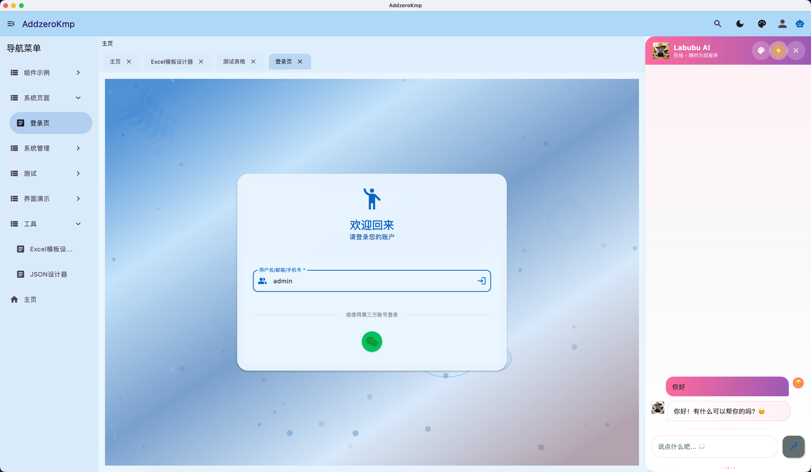
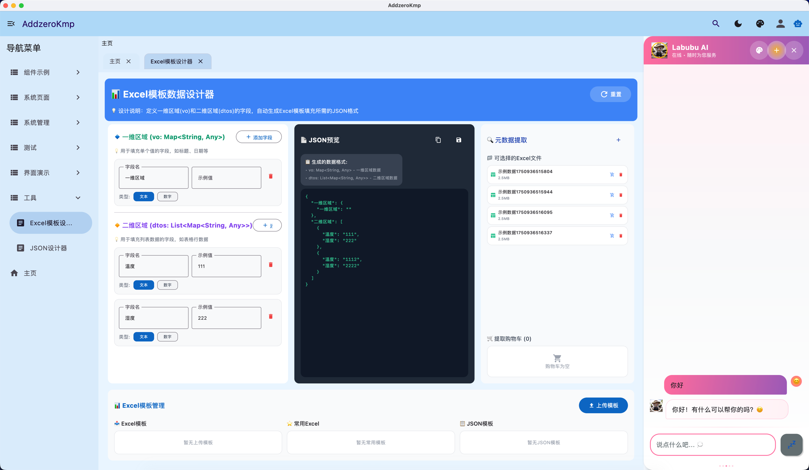
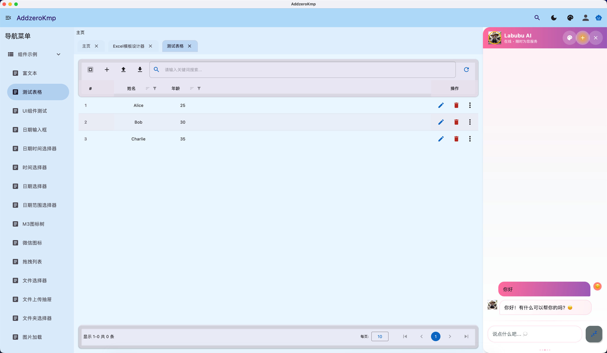
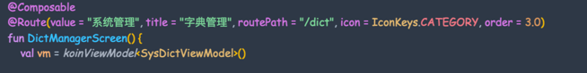

# kmp jimmer脚手架

## 技术栈
[](https://skillicons.dev)







- jimmer实体生成(backend)
- 默认Controller生成(backend)
- 解析Controller符号全自动网络api生成(必须约定入参出单都需要放在跨平台shared)
- 同构体(跨平台shared): SysUserIso
- 字典/枚举(跨平台shared): com.addzero.kmp.generated.enums
- 矢量图标字符串常量: IconKeys
- 矢量图标映射: IconMap
- jdbc元数据(跨平台shared):com.addzero.kmp.jdbc.meta.jdbcMetadata
- 
- 路由导航RouteTable(跨平台composeApp) :RouteTable
- 路由导航常量RouteKeys(跨平台composeApp) :RouteKeys
- todo : 基于jimmer实体生成动态表单(包含校验部分)


## 只需加注解就可以渲染到侧边栏(后续RBAC叠加ksp元数据控制权限)


```kotlin
/**
 * 基于ksp生成的路由表导航
 */
@Composable
fun renderNavContent(navController: NavHostController) {
    NavHost(
        navController = navController,
        startDestination = RouteKeys.HOME_SCREEN,
        modifier = Modifier.fillMaxSize().padding(16.dp)
    ) {
        // 动态生成导航目标
        RouteTable.allRoutes.forEach { (route, content) ->
            composable(route) {
                content()
            }
        }
    }

    NavgationService.initialize(navController)


}

```

# feature: RBAC完善,组件封装,AI智能体

[//]: # (## Acknowledgments)

[//]: # (Thanks to [JetBrains]&#40;https://www.jetbrains.com&#41; for providing free licenses to open source projects.)

[](https://www.jetbrains.com)
